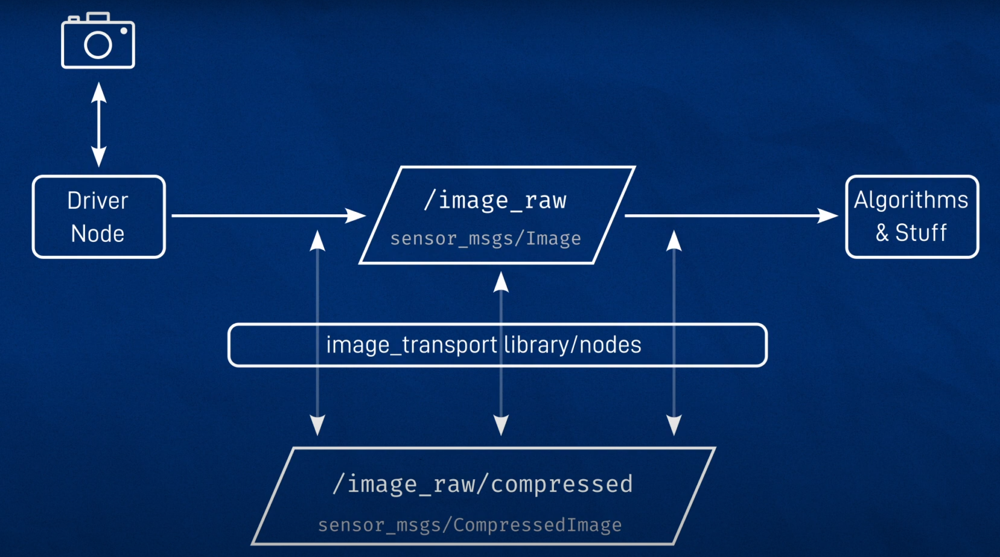

## Getting Started.

This is block diagram that consist of node, message needed to run the Simulated `Camera` in ROS2


Follow below step to start with the setup. This library will work both for `simulations` and `real robot`

## Step 1 : Install following libraries
```
sudo apt-get install v4l-utils ros-humble-v4l2-camera
sudo apt-get install ros-humble-image-transport-plugins ros-humble-rqt-image-view
sudo apt-get install ros-humble-rqt-image-view
```

## Step 2 : Check Camera device availability

To check our camera availability. Run following command
```
groups  --> this command will list down all the groups. We're going below command to video into the group

sudo usermod -aG video jlukas --> this name depend on your computer name
```

If camera is detected you should see message `supported=1, detected=1`. Else, this message won't appear

## Step 3 : This command will list all the video devices
```
v4l2-ctl --list-devices
```

This will display out messages as follow
```
bcm2835-codec-decode (platform:bcm2835-codec):
	/dev/video10
	/dev/video11
	/dev/video12
	/dev/video18
	/dev/video31
	/dev/media2

bcm2835-isp (platform:bcm2835-isp):
	/dev/video13
	/dev/video14
	/dev/video15
	/dev/video16
	/dev/video20
	/dev/video21
	/dev/video22
	/dev/video23
	/dev/media0
	/dev/media1

mmal service 16.1 (platform:bcm2835-v4l2-0):
	/dev/video0
```

## Step 4 : To run our RPI camera

This command will publish `/camera/image_raw` topics that will be used for our computer vision project
```
ros2 run v4l2_camera v4l2_camera_node --ros-args -p image_size:="[640,480]"
```

## Step 5 : To view `published topic image` above.

Run below command to view our publish image either from `simulation` or `rpi camera` 
```
ros2 run rqt_image_view rqt_image_view
```

Select topic from list `/camera/image_raw`. You should see your `simulated` or `rpi` camera video.

## Step 5 : `Rviz2` limiation

Bear in mind `rviz2` cant handle compressed image. Therefore next step, we're going to create compressed and uncompressed images.

Basically, what we did. This command will take the compress image from `Gazebo` and `Uncompress` this to topic

```
ros2 run image_transport republish compressed raw --ros-args -r in/compressed:=/camera/image_raw/compressed -r out:=/camera/image_raw/uncompressed
```


