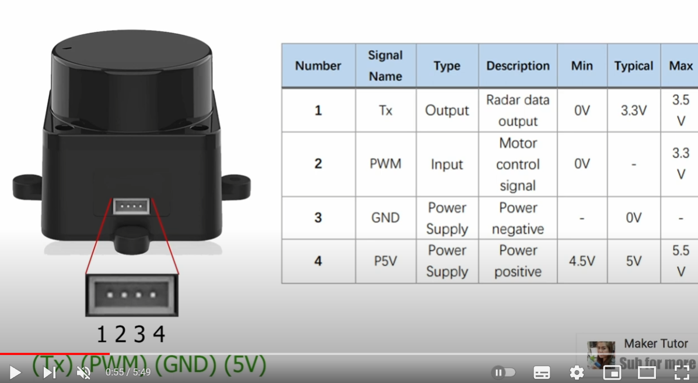
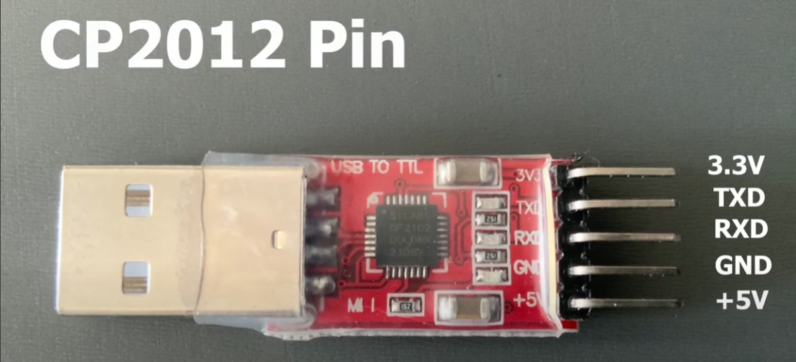
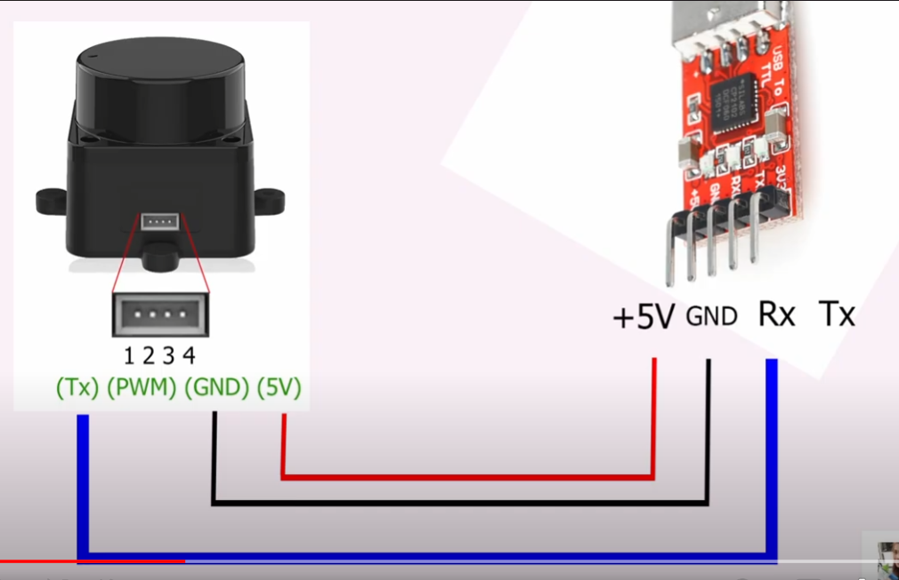

## Getting Started 

In this guide we're going to install `LD06` lidar to our `machine`

## Step 1: Link
Refer to this link to get started
```
https://github.com/ldrobotSensorTeam/ldlidar_stl_ros2
```

## Step 2: Check our Rosversion
```
rosversion -d
```

## Step 3: Create our `lidar` package and follow rest of the setup
```
mkdir -p ldlidar_ros2_ws/src
cd ldlidar_ros2_ws_src
```

## Step 4: Clone the package. This is only for `ROS2`
```
https://github.com/ldrobotSensorTeam/ldlidar_stl_ros2.git
```
 
## Step 5: Setup our `LD06` hardware. Please follow the schematic connection




## Step 6: Find our Lidar `Serial`
```
ls /dev/ttyUSB*

You should see
/dev/ttyUSB0

and run below command
sudo chmod 777 /dev/ttyUSB0
```

## Step 6: Build our package
```
cd src/ldlidar_stl_ros2
vi ld06.launch.py --> Here change the port_name: '/dev/ttyUSB0' based on detected serial. Save and exit the file

cd ../../..

colcon build
```

## Step 7: Source and Global source our `lidar` package
```
source install/setup.bash

We also can add our setup.bash to our ~jlukas/.bashrc script as follow. Save and quite and source our bashrc script again.
source /home/jlukas/Desktop/My_Project/ldlidar_ros2_ws/install/setup.bash
```
## Step 8: Launch `ld06 topic` and publish `/scan` data
```
ros2 launch ldlidar_stl_ros2 ld06.launch.py
```

## Step 9: Display our data in `rviz2`
```
ros2 topic list

You should see 
/scan

Open
rviz2

From rviz select Fixed Frame --> base_link
LaserScan --> Topic --> /scan
TF --> 
```
